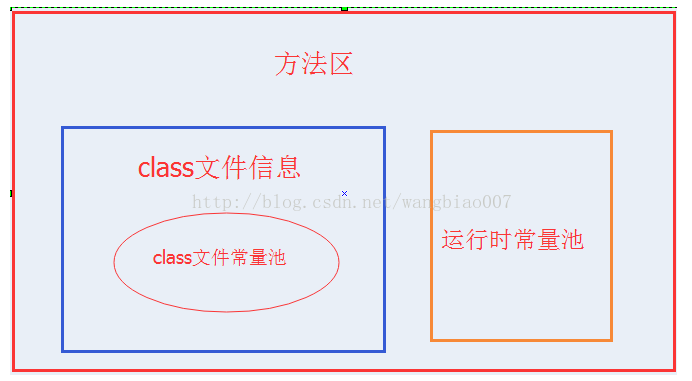

# JVM中常量池存放在哪里

## 常量池存放地址

### java之前

> Java8之前，常量池是存放在堆中的，常量池就相当于是在永久代中，所以永久代存放在堆中。

### java之后

>  Java8之后，取消了整个永久代区域，取而代之的是元空间。常量池就不存放在堆中了，而是存放在方法区里面，与堆栈是并列关系。永久代也就不存放在堆中了。

### 图示

> **私有** 
>
> \- 程序计数器：记录当前线程所执行字节码的行号指示器 
>
> \- 虚拟机栈：存放了当前线程调用方法的局部变量表、操作数栈、动态链接、方法返回值等信息（可以理解为线程的栈） 
>
> \- 本地方法栈：为虚拟机使用的Native方法提供服务，后多与JVM Stack合并为一起

> **共享** 
>
> \- Java堆：占据了虚拟机管理内存中最大的一块（没想到吧），**唯一目的就是存放对象实例**（与引用是两个概念），也是垃圾回收器主要管理的地方，故又称GC堆。
>
>
>
> \- 方法区：**存储加载的类信息、常量区、静态变量、JIT（即时编译器）处理后的数据等**，类的信息包含类的版本、字段、方法、接口等信息。需要注意是常量池就在方法区中，也是我们这次需要关注的地方。方法区因为总是存放不会轻易改变的内容，故又被称之为“永久代”。HotSpot也选择把GC分代收集扩展至方法区，但也容易遇到内存溢出问题。可以选择不实现垃圾回收，但如果回收就主要涉及常量池的回收和类的卸载

# JVM 三大池的比较

### 常量池的好处

常量池是为了避免频繁的创建和销毁对象而影响系统性能，其实现了对象的共享。

### 全局字符串池

> **string pool**也有叫做**string literal pool**

全局字符串池里的内容是在类加载完成，经过验证，**准备阶段之后**在堆中生成字符串对象实例，然后将该字符串对象实例的引用值存到string pool中

> 记住：string pool中存的是引用值而不是具体的实例对象，具体的实例对象是在堆中开辟的一块空间存放的 

HotSpot VM

> 在HotSpot VM里实现的string pool功能的是一个StringTable类，它是一个哈希表，里面存的是驻留字符串(也就是我们常说的用双引号括起来的)的引用（而不是驻留字符串实例本身），也就是说在堆中的某些字符串实例被这个StringTable引用之后就等同被赋予了”驻留字符串”的身份。这个StringTable在每个HotSpot VM的实例只有一份，被所有的类共享。

### class文件常量池

> class constant pool

我们都知道，class文件中除了包含类的

- 版本

- 字段

- 方法

- 接口

- 常量池(constant pool table)

> 用于存放编译器生成的各种
>
> - 字面量(Literal)
>
> > 字面量就是我们所说的常量概念，如文本字符串、被声明为final的常量值等。
>
> - 符号引用(Symbolic References)。
>
> > 符号引用是一组符号来描述所引用的目标，符号可以是任何形式的字面量，只要使用时能无歧义地定位到目标即可（它与直接引用区分一下，直接引用一般是指向方法区的本地指针，相对偏移量或是一个能间接定位到目标的句柄）。

一般包括下面三类引用

- 类和接口的全限定名
- 字段的名称和描述符
- 方法的名称和描述符

常量池的每一项常量都是一个表，一共有如下表所示的12种各不相同的表结构数据，这每个表开始的第一位都是一个字节的标志位（取值1-12），代表当前这个常量属于哪种常量类型。

### 运行时常量池

当java文件被编译成class文件之后，也就是会生成我上面所说的class常量池，那么运行时常量池又是什么时候产生的呢？

jvm在执行某个类的时候，必须经过加载、连接、初始化，而连接又包括验证、准备、解析三个阶段。而当类加载到内存中后，jvm就会将class常量池中的内容存放到运行时常量池中，由此可知，运行时常量池也是每个类都有一个。在上面我也说了，class常量池中存的是字面量和符号引用，也就是说他们存的并不是对象的实例，而是对象的符号引用值。而经过解析（resolve）之后，也就是把符号引用替换为直接引用，解析的过程会去查询全局字符串池，也就是我们上面所说的StringTable，以保证运行时常量池所引用的字符串与全局字符串池中所引用的是一致的。

### 总结

- 全局常量池在每个VM中只有一份，存放的是字符串常量的引用值。
- class常量池是在编译的时候每个class都有的，在编译阶段，存放的是常量的符号引用。
- 运行时常量池是在类加载完成之后，将每个class常量池中的符号引用值转存到运行时常量池中，也就是说，每个class都有一个运行时常量池，类在解析之后，将符号引用替换成直接引用，与全局常量池中的引用值保持一致。

### 问题

- class文件常量池和运行时常量池的关系以及区别

> class文件常量池存储的是当class文件被java虚拟机**加载进来**后存放在方法区的一些**字面量**和**符号引用**，字面量包括**字符串**，**基本类型的常量**，**final的常量**。

> 运行时常量池是当class文件被**加载完成后**，java虚拟机会将class文件常量池里的**内容转移**到运行时常量池里，在class文件常量池的符号引用有一部分是会被转变为**直接引用**的，比如说类的**静态方法**或**私有方法**，实例构造方法，**父类方法**，这是因为这些方法不能被重写其他版本，所以能在加载的时候就可以将符号引用转变为直接引用，而其他的一些方法是在这个方法被第一次调用的时候才会将符号引用转变为直接引用的。

> 方法区里存储着class文件的信息和运行时常量池,class文件的信息包括类信息和class文件常量池。
>
> 运行时常量池里的内容除了是class文件常量池里的内容外，还将class文件常量池里的符号引用转变为直接引用，而且运行时常量池里的内容是能**动态添加**的。例如调用String的intern方法就能将string的值添加到String常量池中，这里String常量池是包含在运行时常量池里的，但在jdk1.8后，将String常量池放到了堆中。

