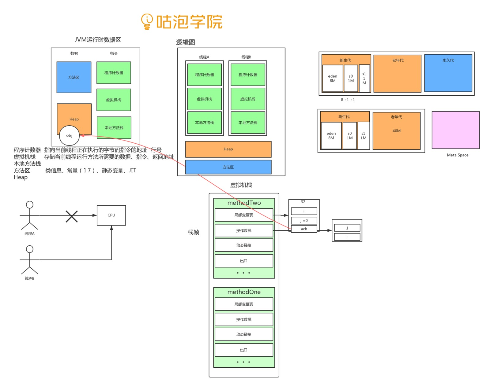
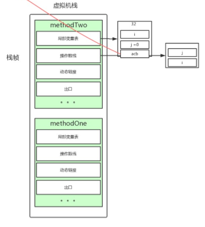
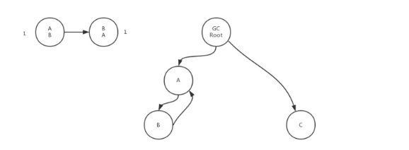

### JVM的功能

1 内存管理

2 软件层面的字节码翻译 

### 为什么要学习JVM

JVM 中内存管理  当出现内存泄露  内存溢出的时候  一无所知,所以要了解JVM

### 运行时数据区

> java代码进入JVM后的分布情况

#### 程序计数器

>  指向当前线程正在执行的字节码指令的地址 行号

#### 虚拟机栈

> 当前线程运行方法所需要的数据 指令 返回地址

##### 栈帧

> 方法压栈
>
> 每一个方法包含四个区域，
>
> - 签名和访问标签
> - 字节码
> - LineNumberTable：为调试器提供源码中的每一行对应的字节码信息。
> - LocalVariableTable：列出了所有栈帧中的局部变量。上面两个例子中，唯一的局部变量就是 this。

###### 局部变量表

> 定宽的编译期就知道大小的区块。
>
> 定宽为32位，4个字节。
>
> 局部变量：
>
> > 八大基本类型: long /double 不是32位的,分两块存储
> >
> > 引用类型
>
>

###### 操作数栈

>字节码相关的运算

###### 动态链接

>

###### 出口

> 正常
>
> 异常

#### 本地方法栈

>本地方法 native

#### 方法区

###### 类信息 

###### 常量 

######  静态变量 

###### JIT

## HEAP

### 内存模型

#### 为什么用分代

> 生命周期不一样

#### 新生代

##### 分代

> eden S0  S1

##### 比例

> 8:1:1

##### 回收算法

> 复制回收算法

##### 为什么8:1:1

- 对象的生命周期不一样

- 需要对象都是朝生夕死 

  >  98%的对象在young gc中被回收

- 提高利用率

- 复制回收算法

 

#### 老年代

##### 分配担保

> young gc 后 s1 （空间）空间不足

#### 永久代

#### META SPACE

> 为什么要设计mate space，
>
> 为了规避永久代溢出的情况
>
> 自动扩容

### 什么样的对象会被回收

#### 判断算法

##### 引用计数

###### 相互引用

###### 循环引用

##### 可达性分析

 

###### GCroot

- 虚拟机栈中局部变量表引用的对象
- 类静态变量引用的对象
- 常量引用的对象
- 本地方法栈JNI引用的对象

## 线程共享

> - 方法区 
>
> - heap

## 线程独享

>  - 程序计数器 
>
>  - 虚拟机栈 
>
>  - 本地方法栈

内存模型

垃圾回收器