# 垃圾回收

## 参数类型

### -X

> 不是所有的JVM都支持

### -XX

> 不是所有的JVM版本都支持

#### -XX:+/-[option]

#### -XX:[option]=[number]

#### -XX:[option]=[string]

## 常用配置

#### 打印垃圾回收程序暂停的时间

##### -XX:+PrintGCApplicationStoppedTime      

#### 开启GC日志打印

##### -XX:+PrintGC

> 打印格式例如：
> [Full GC 131115K->7482K(1015808K), 0.1633180 secs]

#### 打印GC详细信息

##### -XX:+PrintGCDetails 

> 打印格式例如：
>
> [Full GC (System) [Tenured: 0K->2394K(466048K), 0.0624140 secs] 30822K->2394K(518464K), [Perm : 10443K->10443K(16384K)], 0.0625410 secs] [Times: user=0.05 sys=0.01, real=0.06 secs]

#### 打印GC停顿耗时

#####  -XX:+PrintGCTimeStamps     

> 打印格式例如：
>
> 2.744: [Full GC (System) 2.744: [Tenured: 0K->2441K(466048K), 0.0598400 secs] 31754K->2441K(518464K), [Perm : 10717K->10717K(16384K)], 0.0599570 secs] [Times: user=0.06 sys=0.00, real=0.06secs]

#### 设置GC日志输入的文件地址

##### ​   -Xloggc:D:/logs/gc.log 

#### GC日志分块

##### -XX:GCLogFileSize

> -XX:GCLogFileSize=5M

#### 开启GC日志循环，必须有-Xloggc参数

##### -XX:-UseGCLogFileRotation

#### 设置滚动日志文件的个数

##### -XX:NumberOfGCLogFiles

> 设置滚动日志文件的个数，必须大于1
>
> 日志文件命名策略是，<filename>.0, <filename>.1, ..., <filename>.n-1，其中n是该参数的值

#### 堆

##### -Xms

> 堆的起始内存

> -Xms20m

##### -Xmx

> 堆的最大内存
>
> -Xmx20m

#### 新生代

##### 新生代总共

###### -Xmn

> 新生代的大小
>
> -Xmn20m

##### 新生代(eden/from/to)

###### -XX:SurvivorRatio

> -XX:SurvivorRatio=8

#### 老年代与新生代

#####  -XX:NewRatio

>  -XX:NewRatio=2

#### 进入老年代

##### 大对象

###### -XX: PretenureSizeThreshold

> -XX: PretenureSizeThreshold=64K

##### 长期存活对象

###### -XX:MaxTenuringThreshold

> -XX:MaxTenuringThreshold=15

> 每次垃圾收集在新生代之间Copy的次数，超过该次数则移至Old区。

##### 分配担保

> minor gc 之前
>
> 老年代最大连续可用空间  > 新生代所有对象总和

## 概念相关配置

### 栈上分配

> 在JVM中，堆是线程共享的，因此堆上的对象对于各个线程都是共享和可见的，只要持有对象的引用，就可以访问堆中存储的对象数据。虚拟机的垃圾收集系统可以回收堆中不再使用的对象，但对于垃圾收集器来说，无论筛选可回收对象，还是回收和整理内存都需要耗费时间。
>
> 如果确定一个对象的作用域不会逃逸出方法之外，那可以将这个对象分配在栈上，这样，对象所占用的内存空间就可以随栈帧出栈而销毁。在一般应用中，不会逃逸的局部对象所占的比例很大，如果能使用栈上分配，那大量的对象就会随着方法的结束而自动销毁了，无须通过垃圾收集器回收，可以减小垃圾收集器的负载。
>
> JVM允许将线程私有的对象打散分配在栈上，而不是分配在堆上。分配在栈上的好处是可以在函数调用结束后自行销毁，而不需要垃圾回收器的介入，从而提高系统性能。

#### 栈上分配的技术基础

> 只能在server模式下才能启用逃逸分析，参数-XX:DoEscapeAnalysis启用逃逸分析，参数-XX:+EliminateAllocations开启标量替换（默认打开）。Java SE 6u23版本之后，HotSpot中默认就开启了逃逸分析，可以通过选项-XX:+PrintEscapeAnalysis查看逃逸分析的筛选结果。

##### 逃逸分析

> 逃逸分析的目的是判断对象的作用域是否有可能逃逸出函数体。

###### -XX:+DoEscapeAnalysis

> 开启逃逸分析

###### -XX:+PrintEscapeAnalysis

>  查看逃逸分析的筛选结果

##### 标量替换

> 允许将对象打散分配在栈上，比如若一个对象拥有两个字段，会将这两个字段视作局部变量进行分配。

###### XX:+EliminateAllocations

> 开启标量替换

### TLAB

> TLAB的全称是Thread Local Allocation Buffer，即线程本地分配缓存区，这是一个线程专用的内存分配区域。 
> 由于对象一般会分配在堆上，而堆是全局共享的。因此在同一时间，可能会有多个线程在堆上申请空间。因此，每次对象分配都必须要进行同步（虚拟机采用CAS配上失败重试的方式保证更新操作的原子性），而在竞争激烈的场合分配的效率又会进一步下降。JVM使用TLAB来避免多线程冲突，在给对象分配内存时，每个线程使用自己的TLAB，这样可以避免线程同步，提高了对象分配的效率。 
> TLAB本身占用eEden区空间，在开启TLAB的情况下，虚拟机会为**每个Java线程分配一块TLAB空间**。参数-XX:+UseTLAB开启TLAB，默认是开启的。TLAB空间的内存非常小，缺省情况下仅占有整个Eden空间的1%，当然可以通过选项-XX:TLABWasteTargetPercent设置TLAB空间所占用Eden空间的百分比大小。 
> 由于TLAB空间一般不会很大，因此大对象无法在TLAB上进行分配，总是会直接分配在堆上。TLAB空间由于比较小，因此很容易装满。比如，一个100K的空间，已经使用了80KB，当需要再分配一个30KB的对象时，肯定就[无能为力](https://www.baidu.com/s?wd=%E6%97%A0%E8%83%BD%E4%B8%BA%E5%8A%9B&tn=24004469_oem_dg&rsv_dl=gh_pl_sl_csd)了。这时虚拟机会有两种选择，第一，废弃当前TLAB，这样就会浪费20KB空间；第二，将这30KB的对象直接分配在堆上，保留当前的TLAB，这样可以希望将来有小于20KB的对象分配请求可以直接使用这块空间。实际上虚拟机内部会维护一个叫作refill_waste的值，当请求对象大于refill_waste时，会选择在堆中分配，若小于该值，则会废弃当前TLAB，新建TLAB来分配对象。这个阈值可以使用TLABRefillWasteFraction来调整，它表示TLAB中允许产生这种浪费的比例。默认值为64，即表示使用约为1/64的TLAB空间作为refill_waste。默认情况下，TLAB和refill_waste都会在运行时不断调整的，使系统的运行状态达到最优。如果想要禁用自动调整TLAB的大小，可以使用-XX:-ResizeTLAB禁用ResizeTLAB，并使用-XX:TLABSize手工指定一个TLAB的大小。 
> -XX:+PrintTLAB可以跟踪TLAB的使用情况。一般不建议手工修改TLAB相关参数，推荐使用虚拟机默认行为。

#### -XX:+UseTLAB

> 开启TLAB 

#### -XX:TLABWasteTargetPercent

> TLAB空间所占用Eden空间的百分比大小
>
> TLAB空间的内存非常小，缺省情况下仅占有整个Eden空间的1%

## **对象内存分配的两种方法**

> 为对象分配空间的任务等同于把一块确定大小的内存从Java堆中划分出来。

#### 指针碰撞

> (Serial、ParNew等带Compact过程的收集器) 

> 假设Java堆中内存是绝对规整的，所有用过的内存都放在一边，空闲的内存放在另一边，中间放着一个指针作为分界点的指示器，那所分配内存就仅仅是把那个指针向空闲空间那边挪动一段与对象大小相等的距离，这种分配方式称为“指针碰撞”（Bump the Pointer）。

#### 空闲列表

> (CMS这种基于Mark-Sweep算法的收集器)

> 如果Java堆中的内存并不是规整的，已使用的内存和空闲的内存相互交错，那就没有办法简单地进行指针碰撞了，虚拟机就必须维护一个列表，记录上哪些内存块是可用的，在分配的时候从列表中找到一块足够大的空间划分给对象实例，并更新列表上的记录，这种分配方式称为“空闲列表”（Free List）。

### 对象分配流程

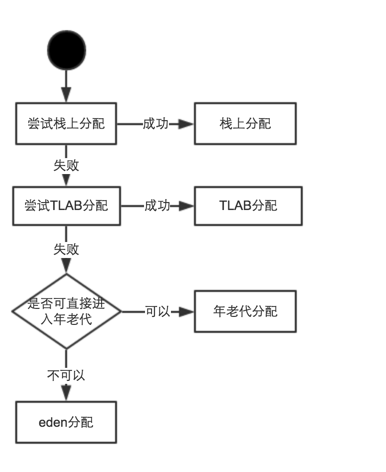

> 如果开启栈上分配，JVM会先进行栈上分配，如果没有开启栈上分配或则不符合条件的则会进行TLAB分配，如果TLAB分配不成功，再尝试在eden区分配，如果对象满足了直接进入老年代的条件，那就直接分配在老年代。

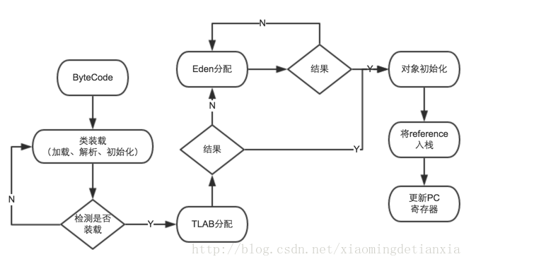

## 引用方式

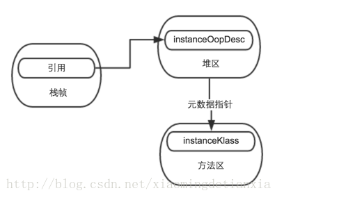

## 对象在内存中的结构

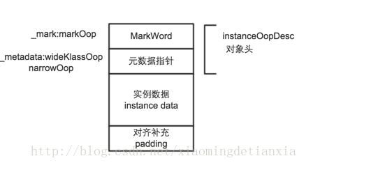

## GC

> 最终目的：减少FULL GC 

### Minor GC

> 新生代

### Major GC

> 老年代

### Full GC

> 新生代 + 老年代

## 回收

### 回收算法

#### 标记-清除

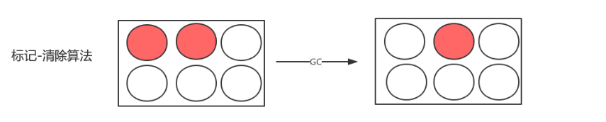

> 空间碎片

#### 复制回收

> 浪费空间
>
> 简单 高效

#### 标记-整理

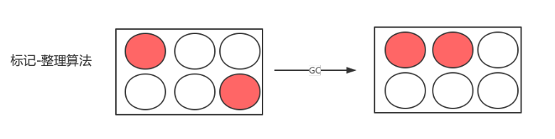

> 没有空间碎片

### 垃圾回收器

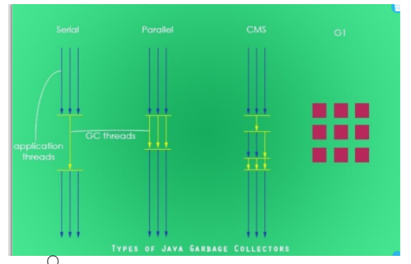

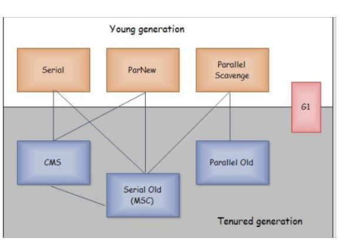

#### serial

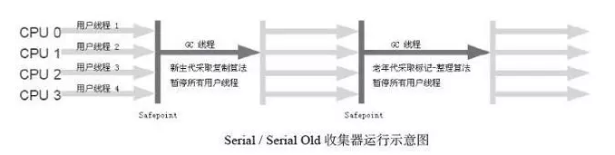

##### 算法

> 复制回收算法

##### 特点

###### 回收线程

> 单线程

#### ParNew

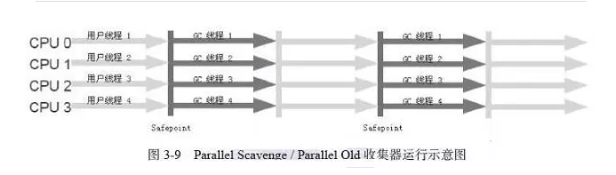

##### 算法

> 复制回收算法

##### 特点

###### 回收线程

> 多线程

###### 指定回收线程数

-XX:ParallelGCThreads

#### Paraller Scavenge（全局）

吞吐量 = 运行用户代码时间 / （运行用户代码时间  + 垃圾收集时间）

##### 算法

> 复制回收算法

##### 特点

###### 吞吐量优先

###### 垃圾回收器最长暂时时间

> -XX:MaxGCPauseMillis=n
>
> > 指定垃圾回收时的最长暂停时间。<N>为毫秒.如果指定了此值的话，堆大小和垃圾回收相关参数会进行调整以达到指定值。设定此值可能会减少应用的吞吐量。

###### 回收时间与非回收时间的比值

> -XX:GCTimeRatio=n
>
> > 为垃圾回收时间与非垃圾回收时间的比值.公式为1:（1+N）。例如，-XX:GCTimeRatio=19时，表示5%的时间用于垃圾回收。默认情况为99，即1%的时间用于垃圾回收。
>
> > 适合吞吐量优先的垃圾收集器。默认值：1%

###### 数据进行统计分析

> -XX:+UseAdaptiveSizePolicy
>
> > 设置此选项后，**并行收集器**会对于收集时间、分配比例、收集之 后 堆的空闲空间等数据进行统计分析，然后以此为依据调整新生代和旧生代的大小以达到最佳效果。此值建议使用并行收集器时，一直打开。

###### GC自适应的调节策略

> Parallel Scavenge收集器有一个参数-`XX:+UseAdaptiveSizePolicy`。当这个参数打开之后，就不需要手工指定新生代的大小、Eden与Survivor区的比例、晋升老年代对象年龄等细节参数了，虚拟机会根据当前系统的运行情况收集性能监控信息，动态调整这些参数以提供最合适的停顿时间或者最大的吞吐量，这种调节方式称为GC自适应的调节策略（GC Ergonomics）。

#### Serial Old

##### 算法

> 标记整理算法

##### 特点

###### 与任意搭配

###### CMS备用方案

> 作为CMS收集器的后备预案，在并发收集发生Concurrent Mode Failure时使用。
>
> 分配担保，失败后Concurrent Mode Failure，会出发FULL GC, 此时老年代使用的就是serial old回收器

#### Parallel Old

##### 算法

> 标记整理算法

##### 特点

###### 应用场景

> 在注重吞吐量以及CPU资源敏感的场合，都可以优先考虑Parallel Scavenge加Parallel Old收集器。

###### 历史

> 这个收集器是在JDK 1.6中才开始提供的，在此之前，新生代的Parallel Scavenge收集器一直处于比较尴尬的状态。原因是，如果新生代选择了Parallel Scavenge收集器，老年代除了Serial Old收集器外别无选择（Parallel Scavenge收集器无法与CMS收集器配合工作）。由于老年代Serial Old收集器在服务端应用性能上的“拖累”，使用了Parallel Scavenge收集器也未必能在整体应用上获得吞吐量最大化的效果，由于单线程的老年代收集中无法充分利用服务器多CPU的处理能力，在老年代很大而且硬件比较高级的环境中，这种组合的吞吐量甚至还不一定有ParNew加CMS的组合“给力”。直到Parallel Old收集器出现后，“吞吐量优先”收集器终于有了比较名副其实的应用组合。

#### CMS

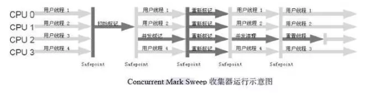

##### 算法

> 标记清除算法

##### 特点

###### 并发收集

###### 减少回收停顿时间

###### 触发的标准及技巧

> -XX：CMSInitiatingOccupancyFraction
>
> https://blog.csdn.net/rodesad/article/details/51544977
>
> 说明老年代到百分之多少满的时候开始执行对老年代的并发垃圾回收（CMS）
>
> 这个参数设置有很大技巧，基本上满足公式：
> (Xmx-Xmn)*(100-CMSInitiatingOccupancyFraction)/100>=Xmn
> 时就不会出现promotion failed。在我的应用中Xmx是6000，Xmn是500，那么Xmx-Xmn是5500兆，也就是老年代有5500兆，CMSInitiatingOccupancyFraction=90说明老年代到90%满的时候开始执行对老年代的并发垃圾回收（CMS），这时还剩10%的空间是5500*10%=550兆，所以即使Xmn（也就是年轻代共500兆）里所有对象都搬到老年代里，550兆的空间也足够了，所以只要满足上面的公式，就不会出现垃圾回收时的promotion failed；如果按照Xmx=2048,Xmn=768的比例计算，则CMSInitiatingOccupancyFraction的值不能超过40，否则就容易出现垃圾回收时的promotion failed。
>
> jdk1.5配合并发垃圾收集器。默认是68%。
>
> JDK 1.6 默认是92%。（太高，建议修改为80%）。

###### 打开压缩

-XX:+UseCMSCompactAtFullCollection

> 打开对老年代的压缩。可能会影响性能，但是可以消除碎片,在FULL GC的时候，压缩内存， CMS是不会移动内存的，因此，这个非常容易产生碎片，导致内存不够用，因此，内存的压缩这个时候就会被启用。增加这个参数是个好习惯。

###### 指定几次full GC压缩

-XX:CMSFullGCsBeforeCompaction

> -XX:CMSFullGCsBeforeCompaction=10
>
> 	由于并发收集器不对内存空间进行压缩、整理，所以运行一段时间以后会产生“碎片”，使得运行效率降低。此值设置运行多少次GC以后对内存空间进行压缩、整理。发生多少次CMS Full GC，这个参数最好不要设置，因为要做compaction的话，也就是真正的Full GC是串行的，非常慢，让它自己去决定什么时候需要做compaction。

###### 指定使用CMS

-XX:+UseConcMarkSweep

> 指定在老年代使用 concurrent cmark sweep gc。gc thread和 app thread并行 (在 init-mark和 remark时 pause app thread)。app pause时间较短 ,适合交互性强的系统 ,如 web server。它可以并发执行收集操作，降低应用停止时间，同时它也是并行处理模式，可以有效地利用多处理器的系统的多进程处理。新生代默认使用：parnew

##### 4大步骤

###### 初始标记（CMS initial mark）

> 初始标记仅仅只是标记一下GC Roots能直接关联到的对象，速度很快，需要“Stop The World”。

###### 并发标记（CMS concurrent mark）

> 并发标记阶段就是进行GC Roots Tracing的过程。

###### 重新标记（CMS remark）

> 重新标记阶段是为了修正并发标记期间因用户程序继续运作而导致标记产生变动的那一部分对象的标记记录，这个阶段的停顿时间一般会比初始标记阶段稍长一些，但远比并发标记的时间短，仍然需要“Stop The World”。

###### 并发清除（CMS concurrent sweep）

> 并发清除阶段会清除对象。

### 垃圾回收的时间节点

#### 方法调用

#### 循环调转 

#### 异常调转

