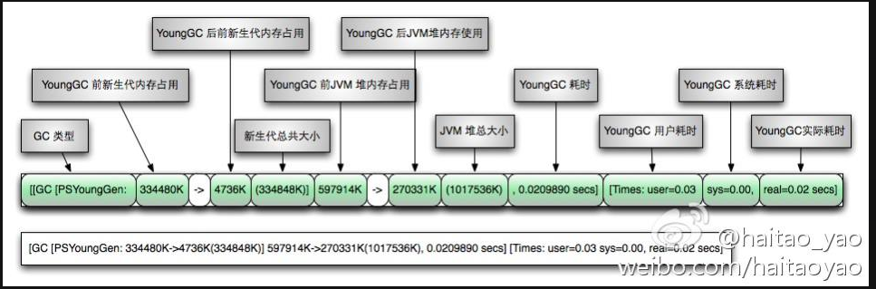
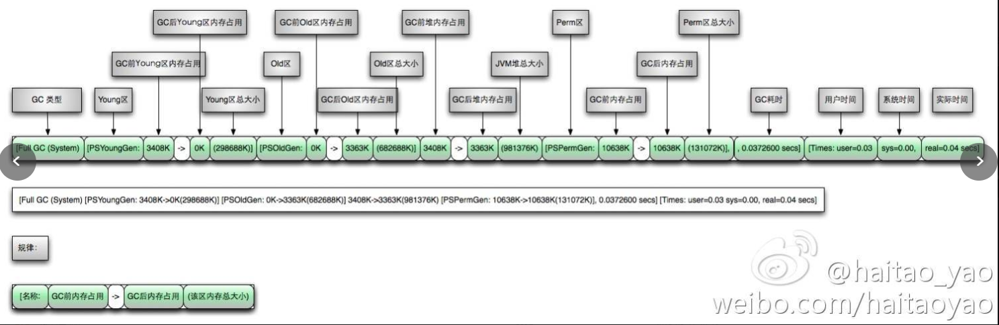
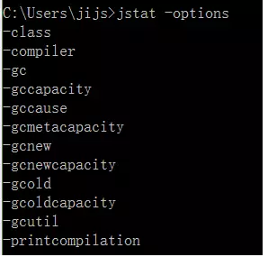

# JVM实操

#### young GC图例



#### Full Gc图例




#### java 自带JVM监控工具

> https://docs.oracle.com/javase/8/docs/technotes/tools/windows/toc.html

##### jmap

###### 网址

> https://docs.oracle.com/javase/8/docs/technotes/tools/windows/jmap.html#CEGCECJB

###### 用途

> 命令用于生成heap dump文件

###### jmap常用配置

> -heap pid
>
> 通过-heap选项，打印java堆的配置情况和使用情况，还有使用的GC算法。

##### jstat

###### 网址

> https://docs.oracle.com/javase/8/docs/technotes/tools/windows/jstat.html#BEHHGFAE

###### 用途

> 利用JVM内建的指令对Java应用程序的资源和性能进行实时的命令行的监控，包括了对Heap size和垃圾回收状况的监控。

###### jstat配置信息

> jmap -options
>
> 查看所有参数
>
> 


> -class                 显示ClassLoad的相关信息；
>
> -compiler           显示JIT编译的相关信息；
>
> -gc                     显示和gc相关的堆信息；
>
> -gccapacity 　　  显示各个代的容量以及使用情况；
>
> -gcmetacapacity 显示metaspace的大小
>
> -gcnew               显示新生代信息；
>
> -gcnewcapacity  显示新生代大小和使用情况；
>
> -gcold                 显示老年代和永久代的信息；
>
> -gcoldcapacity    显示老年代的大小；
>
> -gcutil　　           显示垃圾收集信息；
>
> -gccause             显示垃圾回收的相关信息（通-gcutil）,同时显示最后一次或当前正在发生的垃圾回收的诱因；
>
> -printcompilation 输出JIT编译的方法信息；

###### jstat常用配置

> jstat -gcutil pid time
>
> jstat -gccause pid time


##### jstack

###### 用途

>  jstack命令主要用来查看Java线程的调用堆栈的，可以用来分析线程问题（如死锁）。


##### jvisualvm

> 可视化线程dump


##### jconsole

> 可视化堆栈情况


### MAT

> http://help.eclipse.org/oxygen/index.jsp?topic=/org.eclipse.mat.ui.help/welcome.html

#### 相关概念

##### Histogram(直方图)

> 对象占用的柱状图

###### Objects

###### shallow heap

> 对象自身占用的内存大小，不包括它引用的对象。 

###### retained heap

>  当前对象大小+当前对象可直接或间接引用到的对象的大小总和。(间接引用的含义：A->B->C, C就是间接引用) 

##### Dominator tree(支配树)


# JVM实战思路

#### 1. 确定当前使用的哪个垃圾回收器

##### JVM参数

-XX:+PrintCommandLineFlags

#####MBean

```java
public String info() {
    List<GarbageCollectorMXBean> l = ManagementFactory.getGarbageCollectorMXBeans();
    StringBuffer sb = new StringBuffer();
    for (GarbageCollectorMXBean b : l) {
        sb.append(b.getName() + "\n");
    }
    return sb.toString();
}
```


#### 2. 根据经验设置堆的大小

活跃数据的大小是指，应用程序稳定运行时长期存活对象在堆中占用的空间大小，也就是Full GC后堆中老年代占用空间的大小。可以通过GC日志中Full GC之后老年代数据大小得出，比较准确的方法是在程序稳定后，多次获取GC数据，通过取平均值的方式计算活跃数据的大小。

例如，根据GC日志获得老年代的活跃数据大小为300MB，那么各分区大小可以设为：

> 总堆：1200MB = 300MB × 4
> 新生代：450MB = 300MB × 1.5
> 老年代： 750MB = 1200MB - 450MB*


#### 3. 项目启动不能有FULL GC 

##### Metadata GC Threshold

##### Allocation Faitue

##### GC ergonomice

> 能效GC


#### 4. FULL GC 收集前后的空间变化

> 没有发生变化或者一直在增大，考虑内存泄露

##### 内存泄露


#### 5. CPU的占用比例

##### CMS一直进行FULL GC

> MAT

####发生死锁

> jvisualvm


