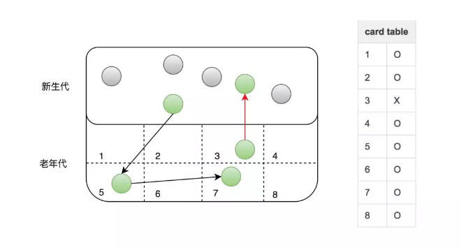

# 老年代新生代相互引用

#### 老年代引用新生代

CMSRemark阶段主要是通过扫描堆来判断对象是否存活。那么准确判断对象是否存活，需要扫描哪些对象？CMS对老年代做回收，Remark阶段仅扫描老年代是否可行？结论是不可行，原因如下：

新生代对象持有老年代中对象的引用，这种情况称为“跨代引用”。因它的存在，Remark阶段必须扫描整个堆来判断对象是否存活，包括图中灰色的不可达对象。

灰色对象已经不可达，但仍然需要扫描的原因：新生代GC和老年代的GC是各自分开独立进行的，只有Minor GC时才会使用根搜索算法，标记新生代对象是否可达，也就是说虽然一些对象已经不可达，但在Minor GC发生前不会被标记为不可达，CMS也无法辨认哪些对象存活，只能全堆扫描（新生代+老年代）。由此可见堆中对象的数目影响了Remark阶段耗时。

分析GC日志可以得出同样的规律，Remark耗时>500ms时，新生代使用率都在75%以上。这样降低Remark阶段耗时问题转换成如何减少新生代对象数量。

新生代中对象的特点是“朝生夕灭”，这样如果Remark前执行一次Minor GC，大部分对象就会被回收。CMS就采用了这样的方式，在Remark前增加了一个可中断的并发预清理（CMS-concurrent-abortable-preclean），该阶段主要工作仍然是并发标记对象是否存活，只是这个过程可被中断。此阶段在Eden区使用超过2Mb时启动，直到Eden区空间使用率达到50%时中断，当然2Mb和50%都是默认的阈值，可以通过参数修改。如果此阶段执行时等到了Minor GC，那么上述灰色对象将被回收，Reamark阶段需要扫描的对象就少了。

除此之外CMS为了避免这个阶段没有等到Minor GC而陷入无限等待，提供了参数CMSMaxAbortablePrecleanTime ，默认为5s，含义是如果可中断的预清理执行超过5s，不管发没发生Minor GC，都会中止此阶段，进入Remark。

根据GC日志红色标记2处显示，可中断的并发预清理执行了5.35s，超过了设置的5s被中断，期间没有等到Minor GC ，所以Remark时新生代中仍然有很多对象。

对于这种情况，CMS提供CMSScavengeBeforeRemark参数，用来保证Remark前强制进行一次Minor GC。

#### 新生代引用老年代

##### 新生代如何避免引用老年代

###### 卡表（以空间换时间）

以上只涉及老年代GC，其实新生代GC存在同样的问题，即老年代可能持有新生代对象引用，所以Minor GC时也必须扫描老年代。

JVM是如何避免Minor GC时扫描全堆的？

经过统计信息显示，老年代持有新生代对象引用的情况不足1%，根据这一特性JVM引入了卡表（card table）来实现这一目的。如下图所示：

卡表的具体策略是将老年代的空间分成大小为512B的若干张卡（card）。卡表本身是单字节数组，数组中的每个元素对应着一张卡，当发生老年代引用新生代时，虚拟机将该卡对应的卡表元素设置为适当的值。如上图所示，卡表3被标记为脏（卡表还有另外的作用，标识并发标记阶段哪些块被修改过），之后Minor GC时通过扫描卡表就可以很快的识别哪些卡中存在老年代指向新生代的引用。这样虚拟机通过空间换时间的方式，避免了全堆扫描。

